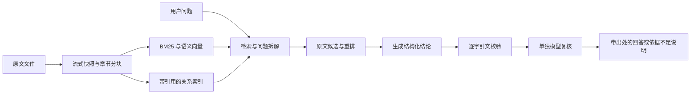

# 原文 · 阅读工作台

独立的文本与小说分析 Agent，包含 **FastAPI 后端 + 简约浏览器前端**。在普通电脑保存和管理多本书，通过模型 API 回答问题、建立语义与人物关系索引、逐批扫描全文。

项目位于 `text_analysis_agent/`，与上级的小说创作项目没有代码、配置或数据依赖。代码注释及文档字符串使用中文。

## 启动与使用

在项目目录（包含 `start.sh` 和 `requirements.txt` 的文件夹）打开终端，安装依赖后启动：

```bash
bash start.sh
```

打开 **http://127.0.0.1:8000**。前端与后端由一个进程提供，无需另外启动 Node 或前端构建服务。

1. **导入原文**：上传 TXT / Markdown，填写书名；支持 UTF-8、GBK / GB18030，单文件最大 128 MB。耗时导入在后台执行。
2. **管理书库**：多本书、书名搜索、修改显示书名、归档与恢复。每本书的问答及任务独立；修改显示书名不会改变原文引用名称。
3. **浏览原文**：章节目录、分页阅读；导入、浏览与“仅查看原文”模式不需要模型密钥。
4. **模型设置**：填写回答模型接口地址、名称、密钥；长小说另配嵌入模型和重排接口。设置保存在本项目 `.env`，密钥不回传到页面。
5. **建立语义索引**：每本书执行一次，后续复用；更换嵌入模型、维度或查询前缀后需重新建立索引。默认混合检索要求完整语义索引，不会悄悄降级为关键词检索。
6. **原文问答**：每条结论附原文引用、章节、行号，点击上下文会高亮并滚动到对应引文。同一本书可以新建、切换、重命名及删除会话，分别保存记录；旧记录迁入“历史会话”。删除会话时会确认，并永久清理其中的问答和相关任务记录，保留书籍、索引及模型用量统计。有问答排队或执行时需等待结束后删除。删除当前会话后切换到其他会话，删除最后一个会话后可直接重新提问。每次只回答当前问题，任何历史问题与历史回答均不进入检索、回答或校验。代词未指明对象时不会从历史消息猜测。缺少依据、冲突或核对未通过时明确说明。
7. **人物与关系 / 全文扫描**：后台建立带证据的关系索引，或针对一个问题逐批扫描全文。开始前展示估计批次数与模型调用量；完成后下载 Markdown 报告和 JSONL 证据。

后台任务与问答记录持久化。服务重启后，每本书最新的未完成关系索引自动从检查点继续，沿用原任务编号；主动暂停的任务保持暂停。语义索引、全文扫描和普通问答中断后仍需点击“继续执行”。语义索引、全文扫描和关系提取会复用已保存的进度。

同一本书正在执行的同类索引任务会被复用，重复点击不会重复建立索引。关系索引可暂停和继续，沿用同一任务编号。其他失败或中断任务重新执行后，旧记录显示“已重试”并关联新任务，重复点击旧记录会返回同一新任务。

关系索引遇到临时网络、限流或服务错误时，在请求级重试耗尽后自动等待 30、60、120、300 秒再恢复，后续最多每 300 秒重试；等待时释放分析线程。连续同一检查点的 JSON 格式错误最多自动恢复三次，取得新进度后计数重置。认证错误或账户额度不足会停止，避免持续发送无效请求。任务页显示恢复倒计时，并提供暂停和立即重试。

同一服务地址与密钥的 API 请求共享并发控制和限流冷却，问答优先于后台扫描。临时限流或连接故障最多重试四次，累计等待预算为 120 秒；遵守服务返回的重试时间，超出预算时显示可识别的服务错误。账户额度不足及认证失败直接报错。任务页面会显示等待与重试进度；这不能保证服务商始终可用。

书籍页面显示“已建立语义索引 / 已建立关系索引”，完成后按钮禁用；执行中显示“建立中”，已有局部进度时可继续建立。关系索引须全文处理完成才标记为已建立，不能仅凭已有关系条数判断；完整处理但未提取到关系时也显示完成。更换嵌入模型后按当前模型重新判断语义索引状态。

语义索引、关系索引及全文扫描会显示**进度条、已完成 / 总量、耗时、预计剩余时间与预计完成时间**，每两秒刷新，重新打开页面仍保留进度。尚未完成首个新批次时显示“正在估算”；已复用的历史段落不计入新任务的处理速度，避免断点恢复时错误地显示即将结束。预计时间根据实际 API 耗时更新，不能保证准确到点。

### 在新电脑安装

需要 Python 3.10+ 和支持 FTS5 的 SQLite；常见 Python 发行版已包含 FTS5。

```bash
python3 -m venv .venv
source .venv/bin/activate
python -m pip install -r requirements.txt
bash start.sh
```

Windows：

```powershell
py -3 -m venv .venv
.venv\Scripts\python.exe -m pip install -r requirements.txt
.\start.bat
```

更换端口：`bash start.sh --port 8080`。停止服务按 `Ctrl+C`；运行中的模型请求会在返回后保存进度并退出。默认只监听本机；这是单用户本地工作台，没有账号系统。部署为多人公网服务需要另行实现认证、用户数据隔离及任务队列。

## 百万字 / 千万字如何处理

不会将整本长篇小说塞进一次模型请求。采用三种互补路径：

| 路径 | 用途 | 工作方式 |
| --- | --- | --- |
| 混合检索问答 | 某个人物、某段情节、局部事实 | 中文词组 BM25 + API 语义向量 + RRF 融合 + 可选 API 重排，有限轮次拆解问题，加入相邻原文 |
| 证据关系索引 | 跨章节人物关系、明确别名、事件关联 | 全文逐批提取并复核关系，每条存储原文引用；有限扩展图谱以定位原文 |
| 全文证据扫描 | 人物事件盘点、需要通读才能核对的问题 | 流式遍历全部段落，逐批提取、逐条复核、断点保存，报告导出全部通过核对的记录 |



新导入通过小缓冲区解码、分块，并保存不可变 UTF-8 文件快照；数据库记录字符与字节偏移。检索后按偏移读取原文、校验哈希，内存不会随整本原文等比例增长。API 嵌入分批提交，向量索引支持增量恢复。

默认向量存储是持久化本地 Qdrant，无需 Docker；本地模式的相关任务依次执行，避免文件锁冲突。较大书库可启用独立 Qdrant 服务，使用 HNSW 和磁盘向量。其检索与存储接口参见 [Qdrant 官方文档](https://qdrant.tech/documentation/search/hybrid-queries/)。

各路检索分别最多提供 40 个候选，融合后保留全部去重候选，不提前截断为 40 条，避免丢掉仅被向量或关键词一路找到的证据。每轮各条改写查询先召回，按名次轮流提供新评分候选，再以原问题统一重排；宽泛查询不能先占满所有评分预算。各轮按累计份额使用预算，后续轮次继续处理早先未评分的候选，并复用已有分数。每批重排最多 32 段，最终回答上下文仍受字符预算限制。

每条查询返回的第一条优先采用重排首位，确保逐查询选取上下文时不会先被保留候选耗尽预算；后续同时保留部分召回靠前的片段，重排分数不拥有排除其他检索依据的全部权重。后续轮次重新从累计召回中选择上下文，避免第一轮的无关原文永久占用上下文。所有问题独立处理，不读取同一会话的历史问题或回答；本次 `previous_queries` 仅用于避免重复检索当前问题。任务结果的 `coverage.retrieval_trace/context_trace` 保存候选编号、评分覆盖、分数及各轮实际选取编号，用于排查召回、预算和上下文选取问题，不保存密钥；日志只记录这些阶段的计数。

### 候选精读与时间线核对

混合检索在检索规划生成的关键词会单独与当前问题核对，拒绝擅自添加具体地点、人物或事件结果。核对只读问题及候选查询，同时生成语言上的动作近义词，每轮增加一次短请求。原词和放宽查询只取当前问题现有的词语，防止把噪声片段中的地点当成问题前提。内部评分、候选编号和调试轨迹保留在任务记录中，不发送给回答或复核模型。

最后一轮每条查询至少保留 16 段候选（较大的 top_k 保持不变），将入围候选及其相邻段落展示为精确原文概览，再由回答模型选择最多 8 段进行完整精读。概览仅用于定位，正式回答仍使用不可变原文段落及精确引用。这样可以让排名稍后的事件段落获得精读机会，避免前几个长段落耗尽上下文预算。这一步增加一次回答模型请求，输入原文字数受当前上下文预算限制，不扩大重排段数或字数预算。

回答中的人物、地点等专名须逐字出现在所选引文中。程序另外请求一次只读取结论文本的专名识别，补查回答模型漏报的名字；只有逐字存在于结论的识别结果才参与引用检查，不引入别称或知识库事实。该步骤增加一次短复核请求。对涉及位置的结论，程序先分别读取每条引文，不提供候选答案，独立区分实际位置、地域身份与来源；再拦截将地域身份或来源改成事件地点的结论。这样避免同一错误答案诱导全部复核过程。该步骤会增加少量复核请求，重复引文在本次任务内只分析一次。

随后分别核对主体、事件或关系、地点等属性、时间线，每项给出支持状态和说明。复核直接读取程序已逐字校验的引用，不再要求模型另外编写证明编号或重复抄写。程序拒绝缺失或冲突，即使模型的总判断为通过也不能放行。前世、今生、回忆或不同版本须分别标明；地域身份、籍贯或事后评论不能直接证明某事件的发生地点。分项核对仍依赖模型理解，不能保证所有语义错误都能被识别。

### 本地多遍分窗重排

本地 Qwen 重排不受 API 的 128 段 / 20 万字预算限制，覆盖本次所有去重后的召回候选。默认每段最多 2 遍：第一遍使用当前问题，补充遍保留当前问题并加入不同的本次检索关键词。没有不同表述时不会重复确定性推理。各遍最高分合并，并继续保留部分召回靠前的原文；多遍评分不能保证小模型判断一定正确。

每批默认 8 段，每批完成保存评分。每段按 1200 字切成重叠窗口，重叠最多 200 字，覆盖全部原文直至末尾；高 token 密度窗口继续按实际 token 数分窗，绝不静默截断。每段取各窗口最高分供检索选择，引用仍从完整原文快照取出并严格校验。窗口算法与大小进入缓存标识，旧的截断评分不会混用。

前端可设置 `LOCAL_RERANK_PASSES`（1–3）、`LOCAL_RERANK_BATCH_SIZE`（1–32）、`LOCAL_RERANK_WINDOW_CHARS`（300–1600）。处理时显示遍数、批次、窗口进度及按实际速度估算的剩余时间；关服时在窗口之间检查停止信号。CPU 候选较多时可能需要数十分钟，回答与嵌入仍有 API 费用。本地“覆盖完整”仅指召回候选，未进入候选的全文段落不能因此视为已检查；需要逐段检查整本书时使用全文扫描。

### 控制重排成本

前端“模型设置 → 检索结果重排”可设置两项 **API** 预算，本地重排不使用这两项预算：

- `RERANK_MAX_DOCUMENTS`：一次问答最多评分的新段落数量，默认 128，范围 0–2048。
- `RERANK_MAX_CHARS`：这些新段落的累计原文字符上限，默认 200,000，范围 0–4,000,000。字符数不等于 token 数，也不包含问题和接口额外输入。

相同模型、接口、问题和原文内容的重排分数缓存 7 天，缓存命中不占新评分预算。缓存位于书库的 `rerank.sqlite3`，仅保存散列及分数，不保存原文、问题或密钥，最多保留 50,000 条。更换模型、接口、密钥或原文内容不会误用旧分数。

预算耗尽时，未评分的候选仍可通过免费排序进入上下文，页面会标示部分候选未重排。预算越低，检索质量可能下降；它控制每次问答的新评分输入量，不是人民币或 token 的精确账单上限。API 限流及连接故障的传输重试可能重复发送同一批输入；页面显示的请求数按逻辑评分批次计数，实际费用以服务商统计为准。

设置任一预算为 0 可停止发送新段落并复用已有缓存；选择“关闭重排”则完全不调用重排模型，仍保留向量与关键词检索。回答、嵌入及复核 API 的费用另计。降低 `top_n` 或只把候选拆成小批次不会减少已提交的原文输入量。

### 下载并使用本地开源重排

“模型设置 → 下载本地重排模型”提供官方 [Qwen3-Reranker-0.6B](https://huggingface.co/Qwen/Qwen3-Reranker-0.6B)，模型文件约 1.2 GB。点击下载可查看字节进度、速度和预计剩余时间；中断后点击继续下载，已下载的部分会保留，文件经过大小和散列校验后才标记完成。权重保存在本项目的 `models/`，不进入 Git。

首次在新环境使用，需要安装本地推理依赖；普通电脑先安装 CPU 版 torch，避免附带大体积 CUDA 依赖：

```bash
.venv/bin/python -m pip install 'torch>=2.2,<3' --index-url https://download.pytorch.org/whl/cpu
.venv/bin/python -m pip install -r requirements-rerank-local.txt
```

有 NVIDIA 显卡且驱动可用时，按 [PyTorch 官方安装说明](https://pytorch.org/get-started/locally/)安装对应的 CUDA 版 PyTorch，例如本项目已验证的 CUDA 12.6 构建：

```bash
.venv/bin/python -m pip install --upgrade torch --index-url https://download.pytorch.org/whl/cu126
.venv/bin/python -c "import torch; print(torch.cuda.is_available())"
```

修改推理依赖后重启服务。GPU 模式使用 float16，自动每次处理最多 4 个窗口，并限制补齐后的 token 总量；显存不足时缩小推理批次重试。每个窗口完整评分，候选和多遍覆盖策略不变。设备进入缓存标识，CPU 与 GPU 分数不会混用。

下载完成后点击 **启用本地重排**，立即保存 `RERANK_PROVIDER=local`、`LOCAL_RERANK_MODEL_ID=Qwen/Qwen3-Reranker-0.6B` 和 `LOCAL_DEVICE=auto`。API 的地址、密钥和模型名仍保留，可以通过重排方式切换后保存。新问答使用新配置，已启动的任务不会更换模型。设备可选择自动、NVIDIA GPU（CUDA）或 CPU；自动模式优先使用可用 CUDA，并在设置页显示实际可用设备。CPU 版 PyTorch 即使机器有 NVIDIA 显卡也无法使用 CUDA。

本地评分遵循官方 yes/no 最后位置打分方式，只用于排序，不能替代原文引用与事实复核。CPU 使用 float32、单窗口推理，单次最多 8192 输入 token；过长原文继续分窗，原文快照不变。模型首次加载需要时间，后续问答复用内存中的模型与评分缓存。大量长段落在 CPU 上可能较慢，可根据实测调整本地遍数和窗口大小。下载和本地评分都不消耗重排 API token；回答、复核及嵌入仍按原配置调用 API。关系索引不会因此切换到此重排模型。

```bash
docker compose up -d
```

随后在前端设置 `QDRANT_URL=http://localhost:6333`，并重新建立各书的语义索引。从本地模式切换服务模式不会自动复制旧向量，原文快照和关键词索引仍保留。个人服务请只启动一个后端进程；默认 SQLite 任务管理用于本机书库，不提供分布式多进程调度。

### 已完成的长文本测试

[实测记录](benchmarks/10m.json)使用 **10,000,000 字合成中文文本**，本机结果：

| 项目 | 结果 |
| --- | ---: |
| 原文分块 | 9,645 段 |
| 导入与关键词建索引 | 9.891 秒 |
| 检索末尾唯一线索并核对引用 | 0.023 秒 |
| 进程峰值内存 | 32.5 MB |
| 快照及 SQLite 索引占用 | 196.21 MB |
| 末尾引用终点 | 第 10,000,000 个字符 |
| 付费模型调用 | 0 |

这验证了流式存储、关键词检索和引用定位，**不是千万字真实小说的语义问答准确率评测**，也不包含向量建库的内存、成本和耗时。真实效果取决于文本、模型、检索召回及复核质量。

同一测试文本按 12,000 字预算全文扫描，需要 877 批；没有格式及传输重试时预计 877–1,754 次模型调用。格式不合格会重新生成一次，仅算格式重试的上限为 3,508 次；每次 API 请求最多五次尝试，连同传输重试的理论上限为 17,540 次。只有产生有效候选结论的批次才调用复核，达到持续错误上限会停止任务。全文扫描的成本与书长成正比，适合需要完整遍历的问题；日常局部问答使用检索路径。预算按原文字符数计算，不等于 token 数，JSON、问题、提示及输出还需要额外上下文。

检索规划通用地生成原词、同义改写、暂时去掉数值和细节约束的事件过程三类查询；三个字段分别输出，避免全是同一句话的重复。程序从空格分隔的核心词组合召回，用原文中两个词的距离挑选候选，再分批重排。不设置特定人物、书籍、事件的固定词表或答案。扩展词仅用于找原文，不代表事件真实发生，也不包含预设地点。每条查询最多额外保留 48 个候选，每组从最多 256 个本地匹配中选择；有限检索仍可能漏掉证据，不能代替通读全文。

问答生成时由模型选择程序提供的引文编号，程序从不可变原文取得连续引文及精确位置，再进行独立复核。引文选择或事件引文核对不合格时，带具体缺失项、复用同一原文最多重新生成一次；两种失败共享这一重试预算，不会无限追加模型调用。同一段内遇到姓名指代或专名缺失时，可将引用扩大到最多 800 字的连续原文，保留真实偏移并继续语义复核；不会改写引文。专名缺失会反馈具体名称供模型补选引用，时期、等级和身份不算专名。页面区分“未找到回答依据”与“回答未通过原文校验”；校验失败会保留部分检索原文供查看，不能解释为原文没有答案。

校验失败的问答可点击“重新核对”，只复用该问题上次实际读取的原文段落并重新生成、复核；不再次调用嵌入和重排模型，也不引入其他历史问题或回答。原文版本不一致时拒绝复用。这能修正引文选择错误，但不能补回上次未检索到的段落；仍可能产生回答和复核 API 费用。

API 问答先用仅包含所选引文的独立请求核对结论，再用完整检索上下文查找矛盾和遗漏。第一阶段不提供章节标题或其他段落，防止将关联背景误当作引文直接支持的事实；任一阶段拒绝的结论不会作为答案输出。这会增加一次复核请求，仍不能保证模型判断永不出错。

## 原文约束

1. **来源隔离**：前端每次问答限定一本书；CLI 多份原文必须显式指定来源。检索器只提供原文定位信息，向量载荷、图谱描述、历史模型回答都不能替代原文证据。
2. **不可变快照**：以导入时原文为准；外部文件修改不影响依据。同名但内容不同的文本拒绝覆盖，新版本需另取名称。
3. **结构化结论**：每条必须附引用。原文台词、传闻、梦境、假设与叙述事实须区分；冲突分别保留，不自行裁决原因。
4. **程序核验**：引文 ID 必须来自当前选中的原文；引文必须是连续、逐字一致的原文。行号、字符区间 `[start,end)`、原文哈希由程序计算或核对，不接受模型伪造位置。
5. **单独复核**：再次调用模型核对每条结论是否被引文支持、有无反证、是否夸大确定性。可单独配置另一款复核模型。核对格式错误、缺项、拒绝结论或引用失真时不给出未经核对的草稿。
6. **范围声明**：小文本可完整纳入上下文；检索路径明确说明只读取了片段。“本次检索未找到”不会当作“全文不存在”。全文扫描记录实际覆盖，但仍明确模型提取可能漏检。

输出状态为 `answered`（有原文依据）、`unclear`（信息不明确或部分依据不足）、`not_found`（本次范围未找到依据）；离线检索为 `extractive`。报告为 `scan_complete` 或 `scan_partial`。

程序能强制验证引文存在，**无法数学保证结论绝无幻觉**；结论是否充分得到支持仍依赖模型，复核也可能出错。回答会保留依据和不确定性供你核对。全文扫描导出局部证据目录，保留矛盾，不声称已自动生成无遗漏的人物传记、时间线或全文总结。

问答记录会保存，但每次重新建立原文依据；目前不自动解析跨轮“他”“刚才那件事”等指代，提问请写明人物和事件。

## API 与模型配置

可直接在前端保存，也可复制 `.env.example` 为本项目 `.env`。只读取本目录配置；进程环境变量优先。不会自动读取上级项目的密钥。

```dotenv
LLM_BASE_URL=https://你的服务商/v1
LLM_MODEL_ID=你的回答模型
LLM_API_KEY=你的密钥
LLM_TIMEOUT=120
LLM_TEMPERATURE=
LLM_JSON_MODE=auto

RETRIEVAL_MODE=hybrid
EMBEDDING_PROVIDER=api
EMBEDDING_BASE_URL=https://你的嵌入服务商/v1
EMBEDDING_MODEL_ID=你的嵌入模型
EMBEDDING_API_KEY=你的嵌入密钥

RERANK_PROVIDER=api
RERANK_URL=https://你的重排服务商/v1/rerank
RERANK_MODEL_ID=你的重排模型
RERANK_API_KEY=你的重排密钥

VERIFY_MODEL_ID=
VERIFY_BASE_URL=
VERIFY_API_KEY=
```

- **回答 / 复核**：兼容 [Chat Completions](https://developers.openai.com/api/reference/python/resources/chat/subresources/completions/methods/create)。未单独配置复核项时复用回答模型。“回答随机性”对应 API 的 `temperature` 参数，数值越低，回答通常越稳定；不支持时留空，支持时可设置 `0`。留空使用模型服务的默认设置，此参数不能保证事实准确。
- **结构化输出**：默认 `LLM_JSON_MODE=auto`，优先请求 JSON Schema 结构约束，接口明确拒绝时依次回退 JSON 对象模式、提示词约束，并记录日志。还会在输入中显式提供输出结构。JSON 模式本身不保证字段结构，所以程序仍校验结构、引文及事实；格式错误最多重新生成一次，持续失败停止当前任务。参数规范参见 [OpenAI 官方文档](https://developers.openai.com/api/docs/guides/structured-outputs?api-mode=chat)。`on` 强制 JSON 对象模式，`off` 仅使用提示词与程序校验。
- **嵌入**：兼容 [Embeddings](https://developers.openai.com/api/reference/python/resources/embeddings/methods/create)，使用浮点向量响应。API 密钥、地址留空时回退到回答服务配置；要求服务实际提供所填写的嵌入模型。
- **重排**：Cohere/Jina 兼容接口使用完整 URL，提交 `model/query/documents/top_n/return_documents`，要求返回 `results:[{index,relevance_score}]`，且包含全部候选的有效编号。也支持千问原生 `/api/v1/services/rerank/text-rerank/text-rerank`：请求使用 `input/parameters`，响应读取 `output.results`；千问官方根地址配合 `qwen3.7-text-rerank` 等原生模型会自动使用对应专用路径，保留原有服务商、模型及密钥。参见[千问官方接口示例](https://www.qianwenai.com/models/qwen3.7-text-rerank)。兼容服务仍需支持对应格式，不能仅根据模型名称判断。没有重排接口时设置 `RERANK_PROVIDER=none`。
- **高质量中文检索候选**：可选择服务商提供的 [Qwen3-Embedding-8B](https://huggingface.co/Qwen/Qwen3-Embedding-8B) 与 [Qwen3-Reranker-8B](https://huggingface.co/Qwen/Qwen3-Reranker-8B)，或 [BGE-M3](https://huggingface.co/BAAI/bge-m3) 与 [bge-reranker-v2-m3](https://huggingface.co/BAAI/bge-reranker-v2-m3)。实际模型 ID 以你的服务商为准；系统没有硬编码服务商或宣称某个模型在所有小说上最好。
- **查询前缀**：按嵌入模型说明配置 `EMBEDDING_QUERY_PREFIX`；例如指令型模型可在 `.env` 中使用双引号值及 `\n`：`"Instruct: Retrieve passages in the original novel that answer the question.\nQuery: "`。修改前缀会生成独立索引身份。
- **可选本地小模型**：安装 `requirements-local.txt`，设置 `EMBEDDING_PROVIDER=local`、对应模型名称及 `RERANK_PROVIDER=local`。普通电脑 + API 的主路径不需要安装 Torch 或下载大模型。

关键词问答可在页面明确选择“关键词检索”，只配置回答模型即可；“仅查看原文”完全不调用模型。问答、全文扫描、图谱与 API 向量建库会把必要文本发送给你配置的服务。项目不含联网搜索工具。

## 命令行

所有命令在本项目目录运行；`--corpus` 放在子命令前，默认 `data/default/` 与前端共享书库。

```bash
source .venv/bin/activate
python -m reader_agent ingest examples/雾港来信.txt
python -m reader_agent list
python -m reader_agent ask "铜钥匙 铁门" --source 雾港来信.txt --extractive

# 长篇先建立语义索引，再进行混合检索问答。
python -m reader_agent index --source 雾港来信.txt
python -m reader_agent ask "林舟用什么打开了哪扇门？" --source 雾港来信.txt --json

# 先查看全文扫描预计调用量，再执行；重复相同配置会恢复进度。
python -m reader_agent scan "林舟的行动记录" --source 雾港来信.txt --dry-run
python -m reader_agent scan "林舟的行动记录" --source 雾港来信.txt
python -m reader_agent build-graph --source 雾港来信.txt
python -m reader_agent graph 林舟 --source 雾港来信.txt
```

多文本比较可重复 `--source`；只有一份原文时可省略。自定义名称使用 `ingest --name`；非 UTF-8 使用 `--encoding gb18030`。可以用 `--corpus data/另一书库` 建立独立书库。`index --repair` 清除当前模型的进度、重写原文向量，可修复缺失或失真的已知段落；远端集合存在额外未知点时需另行重建该集合。

## 使用额度统计

侧栏的 **用量统计**（`/#usage`）分别显示回答模型、嵌入模型、重排模型的调用记录与输入 / 输出 / 总 token，并提供三类汇总、具体模型与用途明细。问题分析、原文提取和结论复核均计入回答模型；即使复核使用不同模型，也会独立列出明细，汇总不重复计算。

支持全部记录、最近 24 小时、7 天、30 天筛选，以及手动刷新；页面打开时每 10 秒更新。统计永久保存在当前书库的 `logs/usage.sqlite3`，重启服务不会清零，也不随日志轮转删除。CLI 使用同一书库时共享统计。

- 新请求按实际 API 尝试记录，失败重试另计一次；响应后校验失败仍保留接口已报告的用量。本地评分以独立用途记录，API token 为 0；复用评分缓存不增加模型调用。
- token 以接口 `usage` 返回为准；缺失字段显示“未返回”，部分缺失时显示“已知”。缓存命中输入是输入的一部分，不重复累加。服务商只返回总 token 时，不猜测输入和输出的拆分。
- 首次启用会补入仍保留的模型日志，按调用编号去重。旧日志统计的是逻辑调用，无法还原所有传输重试；缺失的嵌入 / 重排用量和已删除日志不能补算。
- 此页面统计本项目消耗，不读取服务商账户余额，也不把 token 换算成猜测的费用；失败或连接中断的请求是否计费，以服务商账单为准。

统计仅保存模型名称、数值和任务编号，不保存密钥、原文、问题或模型回复。接口为 `GET /api/usage?days=7`，`days=0` 表示全部记录。

## 日志与排错

启动服务后自动在当前书库的 `logs/` 生成日志，默认路径为 `data/default/logs/`：

| 文件 | 内容 |
| --- | --- |
| `runtime.log` | 服务启停、任务排队与进度、模型名称、调用耗时、可用的 token 统计、校验与重试 |
| `errors.log` | 异常类型、调用位置和异常链，HTTP 状态及可识别的服务错误码 |
| `access.log` | 请求 ID、方法、路由模板、状态码和耗时 |

日志为 UTF-8 JSON，每行一条，带 UTC 时间、级别及请求 / 任务 ID。每个文件达到 **5 MB** 自动轮转，最多保留 **5 个历史文件**。请求响应头提供 `X-Request-ID`；后台任务使用其 `id` 查日志，任务排队记录将两个 ID 关联。CLI 命令也会在指定书库中写日志。

```bash
# 实时观察运行与异常。
tail -f data/default/logs/runtime.log
tail -f data/default/logs/errors.log

# 按后台任务 ID 查找记录，包括轮转文件。
rg '任务的完整ID' data/default/logs/
```

日志不保存密钥、原文、用户问题、完整提示词、模型回复或外部异常响应体；异常调用栈不包含局部变量及源代码行。已配置的密钥会脱敏，访问日志不记录查询参数。无法验证的关系候选会单独拒绝，并记录数量，不把它们加入图谱，也不会因单条错误关系丢弃整个批次的有效证据。程序可从同一原文段落补齐引文中遗漏的姓名上下文，新增内容仍是逐字原文，扩展后的证据必须再经模型复核；不能借此修补伪造引文或改写关系。批次全部被拒绝时仍保留“不明确”及拒绝数量，不能把它视为原文没有相关事实。

## 验证与文件

```bash
python -m unittest discover -s tests -v
python tools/benchmark_long_text.py --chars 10000000 --output benchmarks/10m.json
```

测试不使用真实模型 API。覆盖逐字引用、伪造证据拒绝、复核缺项、矛盾与不确定性、来源隔离、快照篡改、流式长文本、扫描恢复、复核模型变更、实际本地 Qdrant 索引、API 响应校验、书库上传及任务恢复。额外的 `tools/browser_smoke.cjs` 用 Playwright 验证浏览器操作；仅用于开发，运行项目不依赖它。

```text
reader_agent/
  corpus.py       原文快照、流式分块、BM25、精确引用定位
  retrieval.py    API 嵌入、Qdrant、融合检索、重排
  agent.py        检索规划、回答、引文校验、单独复核
  scan.py         全文批处理、断点与全量证据报告
  graph.py        带引用及归属标记的实体关系
  library.py      多本书与后台任务持久化
  server.py       FastAPI 与前端接口
  cli.py          命令行
web/              无需构建的简约前端
examples/         可上传的中文测试短篇
tests/            无付费模型调用的测试
benchmarks/       长文本实测记录
start.sh          Linux / macOS 启动
start.bat         Windows 启动
```

`data/default/` 保存不可变快照、SQLite 索引、上传文件、任务、向量与证据报告，`.env` 保存本项目设置；都已加入 `.gitignore`。备份时保留完整 `data/`，不要仅复制其中一个数据库。归档不删除原文，当前界面不提供永久删除。
